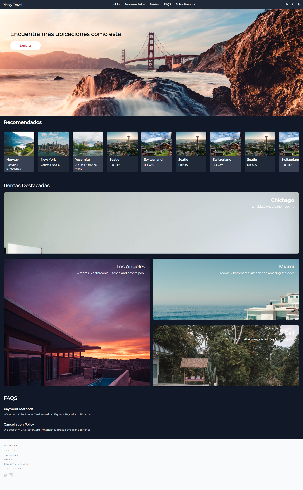

# Platzy Travel

Para instalar las dependencias, ejecuta el siguiente comando:

```node
npm install
```

Para compilar tailwindcss, ejecutar:

```node
npm run tw:build
```

Para crear el mimificado tailwindcss, ejecutar:

```node
npm run tw:build:prod
```

## Vista de la Página


